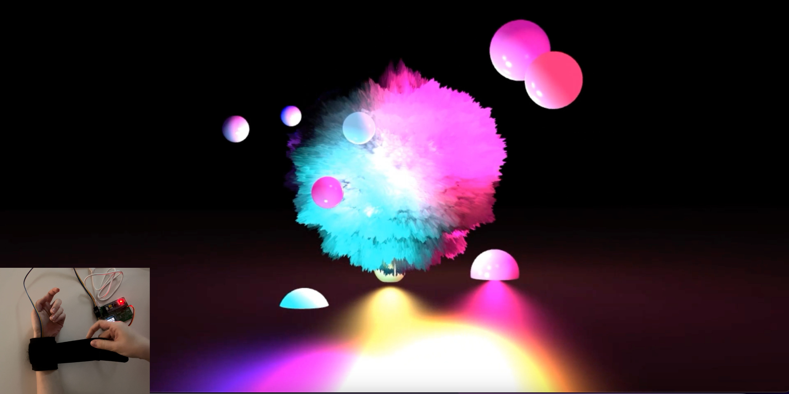

# Sound of Body



**Sound of Body** is a wearable biometric sonification installation. It merges
the melodies of external sounds with the unique rhythms of the human body,
inviting individuals to perceive and appreciate the harmonious collision of
external and internal symphonies — turning the body's physiological signals
into a personalised musical composition.

A wrist-worn sensor measures heart rate and blood pressure over 30 seconds.
A Python script maps each signal to a musical dimension, synthesises a music
track, and overlays it onto a randomly selected video clip that plays
automatically.

| Biometric signal | Musical dimension | Detail |
|---|---|---|
| Heart rate (67–86 BPM) | **Pitch** | Selects a harmonic tone (note A2–G4) |
| Diastolic | **Tempo** | Lower → slower beat interval (15 s → 7.5 s) |
| Systolic | **Timbre** | Selects drumbeat type: gasp / sigh / heartbeat |

---

## Hardware

| Component | Part |
|---|---|
| Heart rate + blood pressure sensor | MKB0805 dynamic PPG module |
| Microcontroller | STM32 display kit |
| PC connection | CH340 USB-serial adapter |

**Wiring**

The MKB0805 module has a 3-wire bundle (VCC / GND / data) that plugs directly
into the matching 3-pin UART header on the STM32 board — no additional wiring
required. The STM32 board connects to the host PC via the CH340 USB-serial
bridge at 115200 baud. The default port is `COM3`
(configurable — see [Configuration](#configuration)).

**Supported OS:** Windows 10 / 11 only. COM port naming is Windows-specific;
macOS and Linux are not supported without code changes.

---

## Setup

### 1. Python environment

Python **3.11** is required.

```bash
conda create -n sound-of-body python=3.11
conda activate sound-of-body
pip install -r requirements.txt
```

<details>
<summary>Using venv instead</summary>

```bash
python3.11 -m venv .venv
.venv\Scripts\activate
pip install -r requirements.txt
```

</details>

> **ffmpeg** — `imageio-ffmpeg` (installed via `requirements.txt`) bundles
> the ffmpeg binary used for audio tempo adjustment. No separate system-level
> ffmpeg installation is needed.

### 2. Configuration

The script reads serial-port settings from a `.env` file. `.env` is **not**
included in this repository (it is gitignored). Create it by copying the
provided template:

```bash
copy .env.example .env   # Windows
```

Then open `.env` and set the correct COM port for your machine:

```
SERIAL_PORT=COM3    # change to match your Device Manager entry
BAUD_RATE=115200    # must match the microcontroller firmware setting
```

**Finding the port:** Device Manager → Ports (COM & LPT) → look for the CH340
entry after plugging in both USB devices. If nothing appears, install the
[CH340 driver](https://www.wch.cn/downloads/CH341SER_EXE.html) (Windows 11
may drop it after an OS upgrade).

---

## Running

1. Plug in both USB devices.
2. Put on the wrist sensor and wait until all three readings (heart rate,
   systolic, diastolic) are stable on the sensor display.
3. Run:

```bash
python heartbeat.py
```

Keep your hand still during the 30-second measurement. If a reading resets
mid-collection, the script waits and collects again automatically.

**Total runtime: ~1 minute**

| Phase | Duration | Notes |
|---|---|---|
| Data collection | ~30 s | Reads 30 sensor samples over serial |
| Music + video synthesis | ~30 s | CPU-intensive; fan noise is normal |

The output video opens automatically and is saved to `music/output/`.

---

## Project structure

```
sound-of-body/
├── heartbeat.py          # Main script
├── requirements.txt      # Python dependencies
├── .env.example          # Serial port config template  →  copy to .env
├── .gitignore
├── README.md
└── music/
    ├── blood_pressure/   # Drumbeat samples  (gasp / sigh / heartbeat × 4 diastolic levels)
    ├── heart_rate/       # Harmonic tones    (one WAV per BPM, 67–86)
    └── video/            # Background clips  (25 s / 39 s / 56 s)
```

### Pre-compiled Windows executable

A `dist/` folder (gitignored) contains a PyInstaller bundle with the full
Windows Python 3.11 runtime. To run without Python, copy the entire `dist/`
folder with `music/` alongside it and double-click `heartbeat.exe`.
